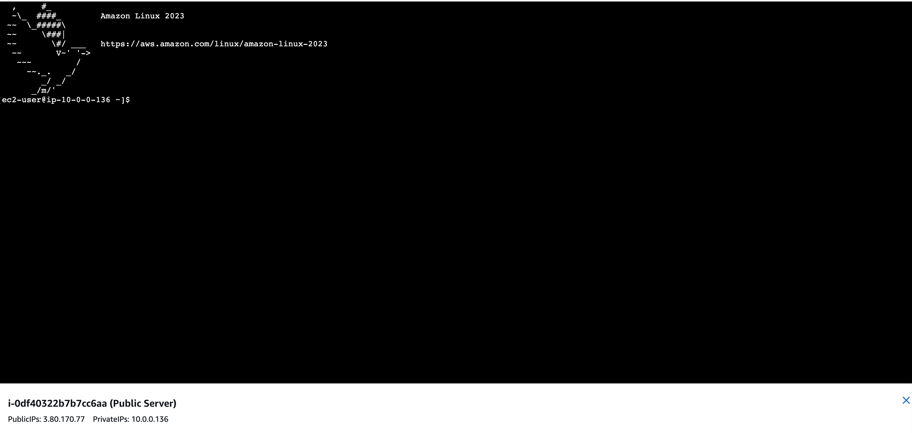
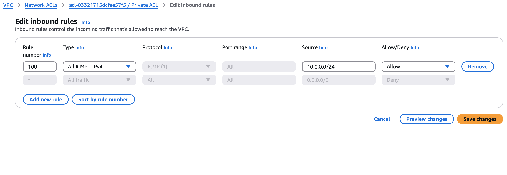

# 📌 **Testing VPC Connectivity – AWS Project**

This project demonstrates the setup and testing of a Virtual Private Cloud (VPC) in AWS, including public and private subnets, internet connectivity, security group configurations, and EC2 communication.

---

## 🛠 **Environments and Technologies Used**
- AWS VPC
- Amazon EC2
- Security Groups & Network ACLs
- Route Tables & Internet Gateway
- Linux CLI (Terminal, Ping, SSH)

---

## 📌 **VPC Architecture**

Before starting, let's look at the overall architecture of the VPC.

---

## 📌 **Step 1: Creating a VPC**

The first step is creating a Virtual Private Cloud (VPC) in AWS.

---

## 📌 **Step 2: Public and Private Subnet Creation**

Two subnets are created:

- ✅ **Public Subnet** – For public-facing resources like a web server.
- ✅ **Private Subnet** – For internal services that shouldn’t be directly accessible from the internet.

---

## 📌 **Step 3: Internet Gateway (IGW) & Route Tables**

To allow the public subnet to access the internet, an Internet Gateway (IGW) is attached, and the Public Route Table is configured.

- **Attaching an Internet Gateway**
  

- **Public Route Table Configuration**
  

- **Private Route Table Configuration**
  

---

## 📌 **Step 4: Configuring Security Groups**

Security Groups are configured to control inbound and outbound traffic.

- **Public Security Group – Inbound Rules**

- **Private Security Group – Inbound Rules**

---

## 📌 **Step 5: Configuring Network ACLs**

Network ACLs (Access Control Lists) are configured to provide an additional layer of security.

- **Public Network ACL Rules**

  
- **Private Network ACL Rules**

  ---

## 📌 **Step 6: Launching EC2 Instances**

Two EC2 instances are launched:

- ✅ **Public EC2 Instance** – Accessible via SSH from the internet.
- ✅ **Private EC2 Instance** – Only accessible from the Public EC2 Instance.

- **Public Server Instance**
  

- **Private Server Instance**
  

---

## 📌 Step 7: Troubleshooting Public Server Connection
If the public server fails to connect, the issue is likely with the Public Security Group settings or inbound rule misconfigurations.

✅ Check Public Security Group Inbound Rules

Ensure the Public Security Group allows SSH (port 22) and HTTP (port 80) traffic.

✅ Public Security Group - Inbound Rules Example:

✅ Ensure the Instance is Connected to the Public Security Group

If the instance is configured with any other security group or port settings, update it to use the Public Security Group with the correct rules.

✅ Successful Public Linux Connection

## 📌 Step 8: Troubleshooting Private Server Connection (Failed Ping)
After successfully connecting to the public server, the next step is to ping the private server to test connectivity.

💻 Attempt to Ping the Private Server
Run the following command from the Public EC2 instance:

ping <Private-EC2-IP>
✅ Example Command:
ping <Private-EC2-IP>

⚠️If the Ping  Fails, Check These Settings:
✅ Check Private Route Table
Verify that the private subnet is associated with the correct route table.

Fix Private Network ACL Rules
The issue might be restrictive Network ACL (NACL) settings.

1️⃣ Correct Private NACL Inbound Rules:

Rule #	Type	Protocol	Port Range	Source	Description
100	All ICMP - IPv4	ICMP	ALL	10.0.0.0/24	Allows ping traffic
        

2️⃣ Correct Private NACL Outbound Rules and make it the same

3️⃣ If NACLs look fine, check the Private Security Group inbound rules.
✅ Ensure the following rule exists:

Rule #	Type	Protocol	Port Range	Source	Description
100	All ICMP - IPv4	ICMP	ALL	10.0.0.0/24	Allows ping traffic

✅ Final Successful Ping Test

🔎 Summary of Fixes for Failed Ping Issues
1️⃣ Ensure the Private Subnet is correctly set up.
2️⃣ Verify the Private Route Table.
3️⃣ Fix Private Network ACL Rules (Allow ICMP).
4️⃣ Check Private Security Group Inbound Rules.
