# 📌 Testing VPC Connectivity – AWS Project  

This project demonstrates the setup and testing of a **Virtual Private Cloud (VPC)** in AWS, including public and private subnets, internet connectivity, security group configurations, and EC2 communication.

---

## 🛠 Environments and Technologies Used
- **AWS VPC**
- **Amazon EC2**
- **Security Groups & Network ACLs**
- **Route Tables & Internet Gateway**
- **Linux CLI (Terminal, Ping, SSH)**

---

## 📍 VPC Architecture  
Before starting, let's look at the overall architecture of our VPC.

---

## 📌 Step 1: Creating a VPC  
We begin by creating a **Virtual Private Cloud (VPC)** in AWS.

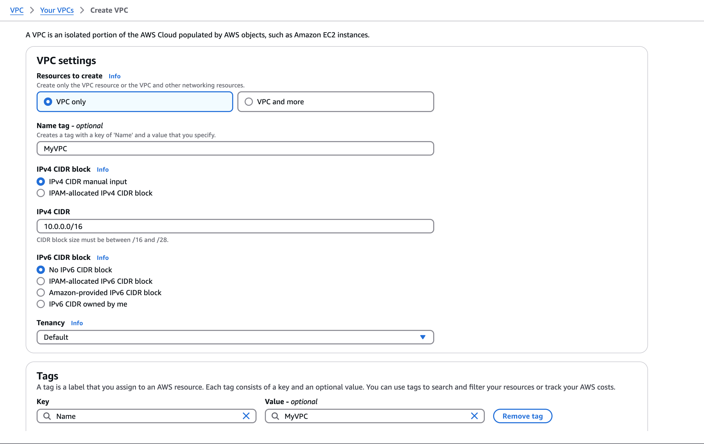

---

## 📌 Step 2: Public and Private Subnet Creation  
We create two subnets:  
✅ **Public Subnet** (for public-facing resources like a web server)  
✅ **Private Subnet** (for internal services that shouldn’t be directly accessible from the internet)  

**Public Subnet Creation**  
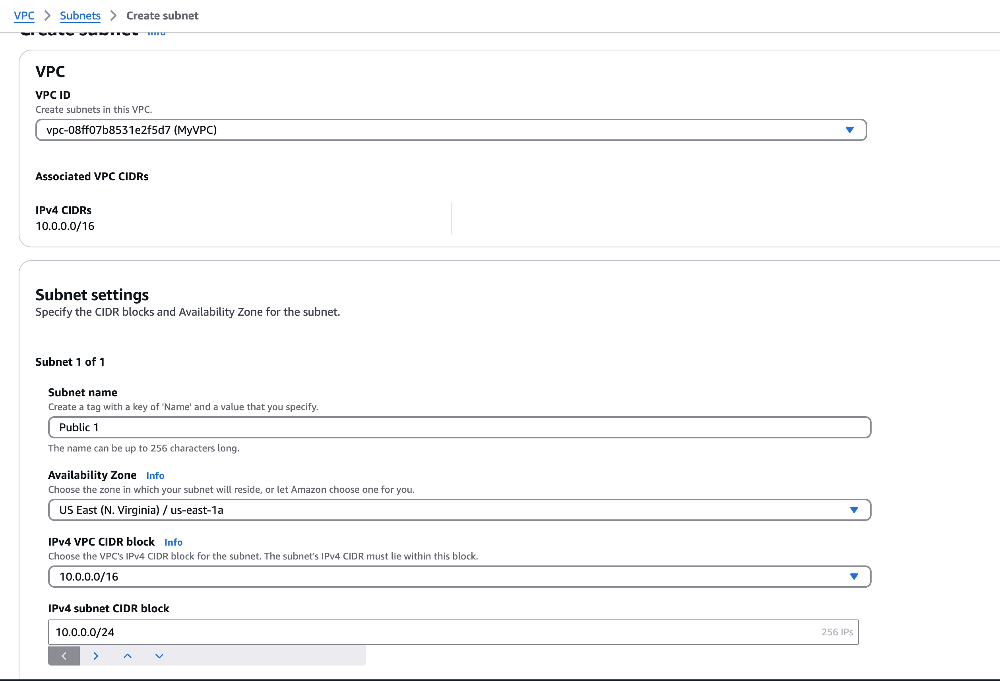

**Private Subnet Creation**  

---

## 📌 Step 3: Internet Gateway (IGW) & Route Tables  
To allow the public subnet to access the internet, we attach an **Internet Gateway (IGW)** and configure the **Public Route Table**.

**Attaching an Internet Gateway**  

**Public Route Table Configuration**  
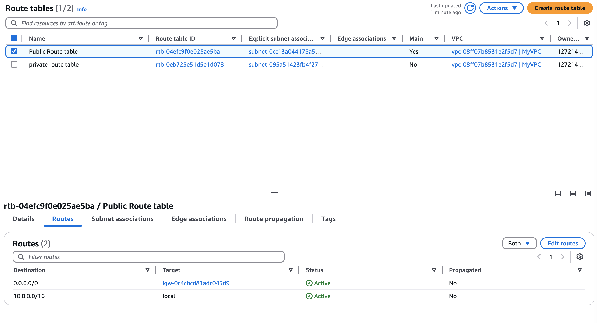

**Private Route Table Configuration**  
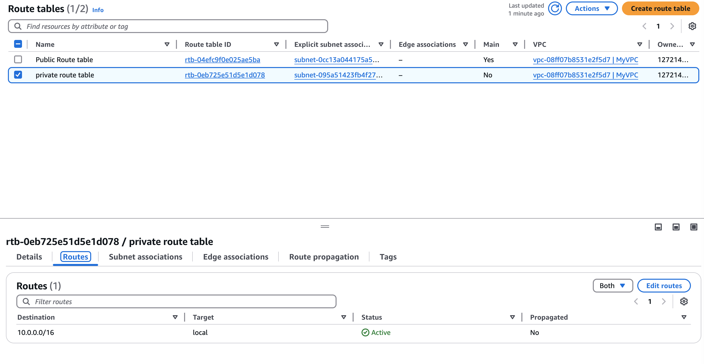

---

## 📌 Step 4: Configuring Security Groups  
We configure **Security Groups** to control inbound and outbound traffic.

**Public Security Group - Inbound Rules**  
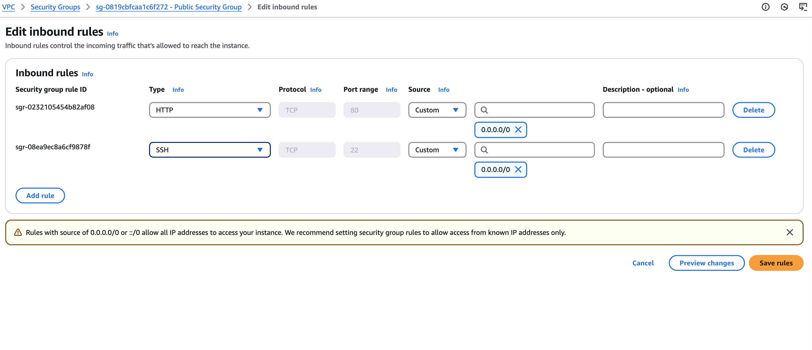

**Public Security Group - Outbound Rules**  
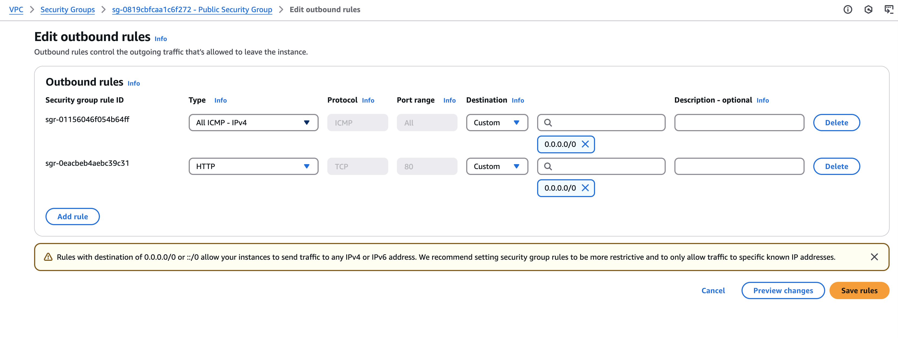

**Private Security Group - Inbound Rules**  
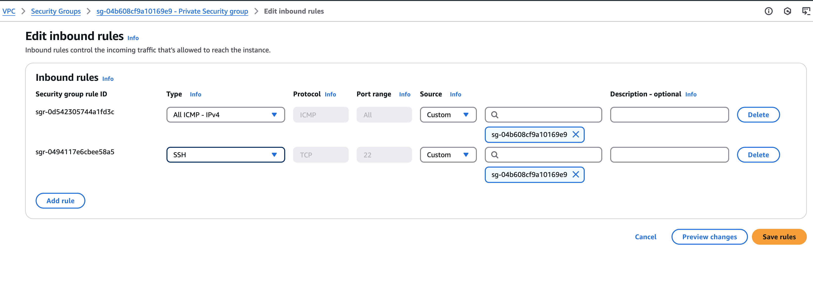

**Private Security Group - Outbound Rules**  

---

## 📌 Step 5: Configuring Network ACLs  
We configure **Network ACLs (Access Control Lists)** to provide another layer of security.

**Public Network ACL Rules**  

**Private Network ACL Rules**  
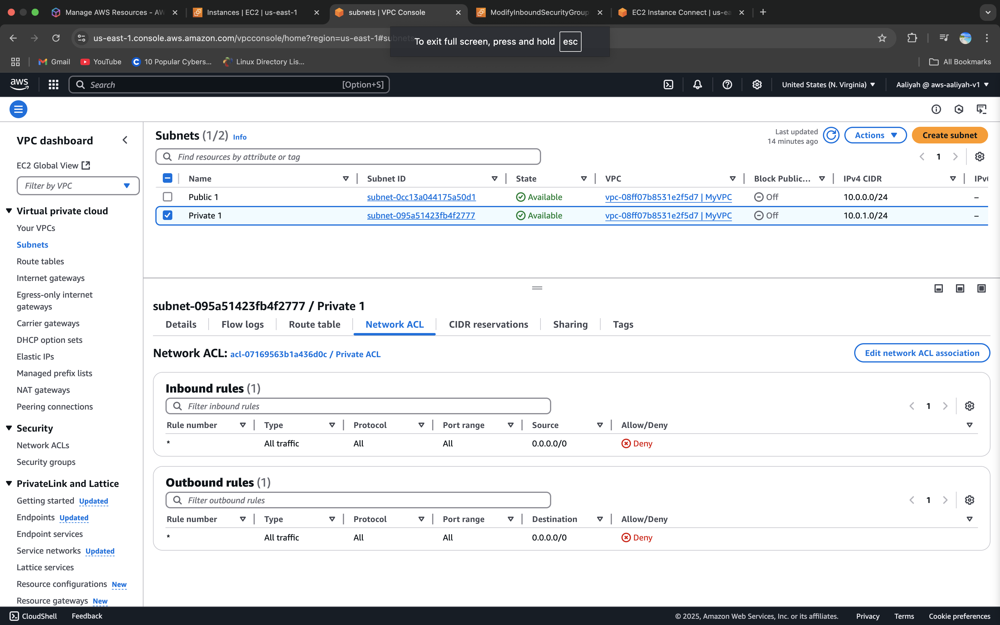

**Updating Private Network ACL Rules**  

---

## 📌 Step 6: Launching EC2 Instances  
We launch two EC2 instances:  
✅ **Public EC2 Instance** – Accessible via SSH from the internet  
✅ **Private EC2 Instance** – Only accessible from the Public EC2 Instance  

**Public Server Instance**  
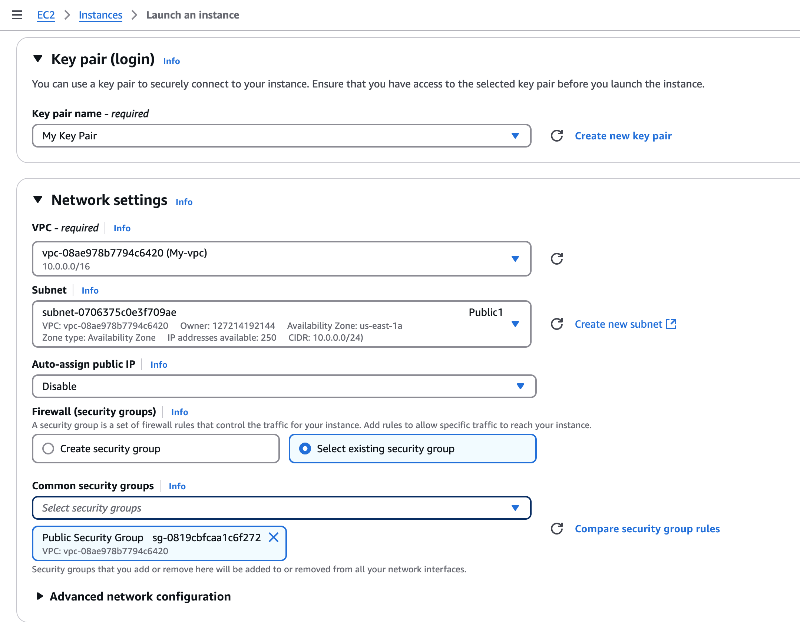

**Private Server Instance**  
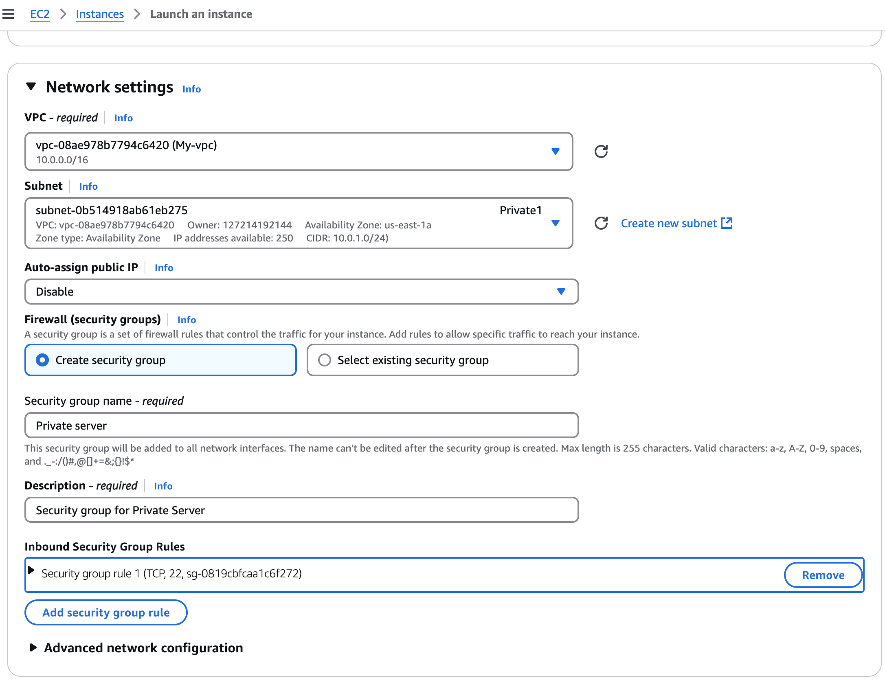

---

## 📌 Step 7: Testing Connectivity  

### ✅ 1️⃣ Connecting to Public Server (EC2) via AWS Console  
**Public EC2 Linux Connection**  

### ✅ 2️⃣ Testing Private EC2 Connectivity (via SSH or Ping)  
**Ping Private EC2 from Public EC2**  
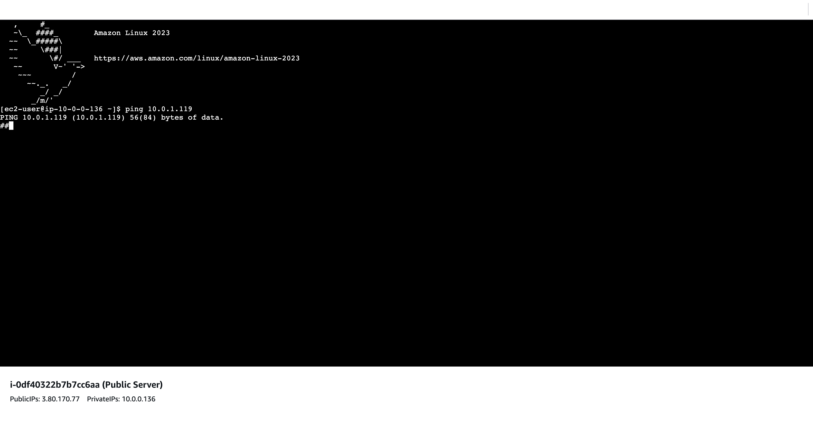

---

## 📌 Step 8: Internet Connectivity Testing  
Now, we test whether the **Public EC2 instance** can reach the internet.

**Successful Internet Connection Test**  

**Failed Connection Example**  
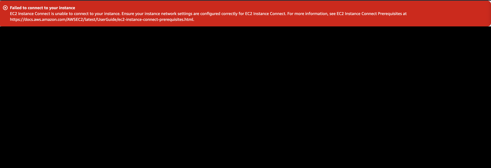

---

## 📌 Summary  
- 🎯 **Configured a VPC with Public & Private Subnets**  
- 🎯 **Attached an Internet Gateway and Configured Route Tables**  
- 🎯 **Created and Applied Security Groups & Network ACL Rules**  
- 🎯 **Launched EC2 Instances & Established Secure Connectivity**  
- 🎯 **Verified Connectivity & Troubleshot Issues**

---

## 💡 Lessons Learned  
- Importance of **Route Tables** and **Network ACLs** in managing traffic.  
- Difference between **Security Groups** and **Network ACLs**.  
- How to establish **private networking** within AWS.

---

## 🚀 Next Steps  
- Implement a **Bastion Host** to securely access the private EC2 instance.  
- Automate the setup using **AWS CloudFormation or Terraform**.  
- Configure **VPN or Direct Connect** for private connectivity.  
